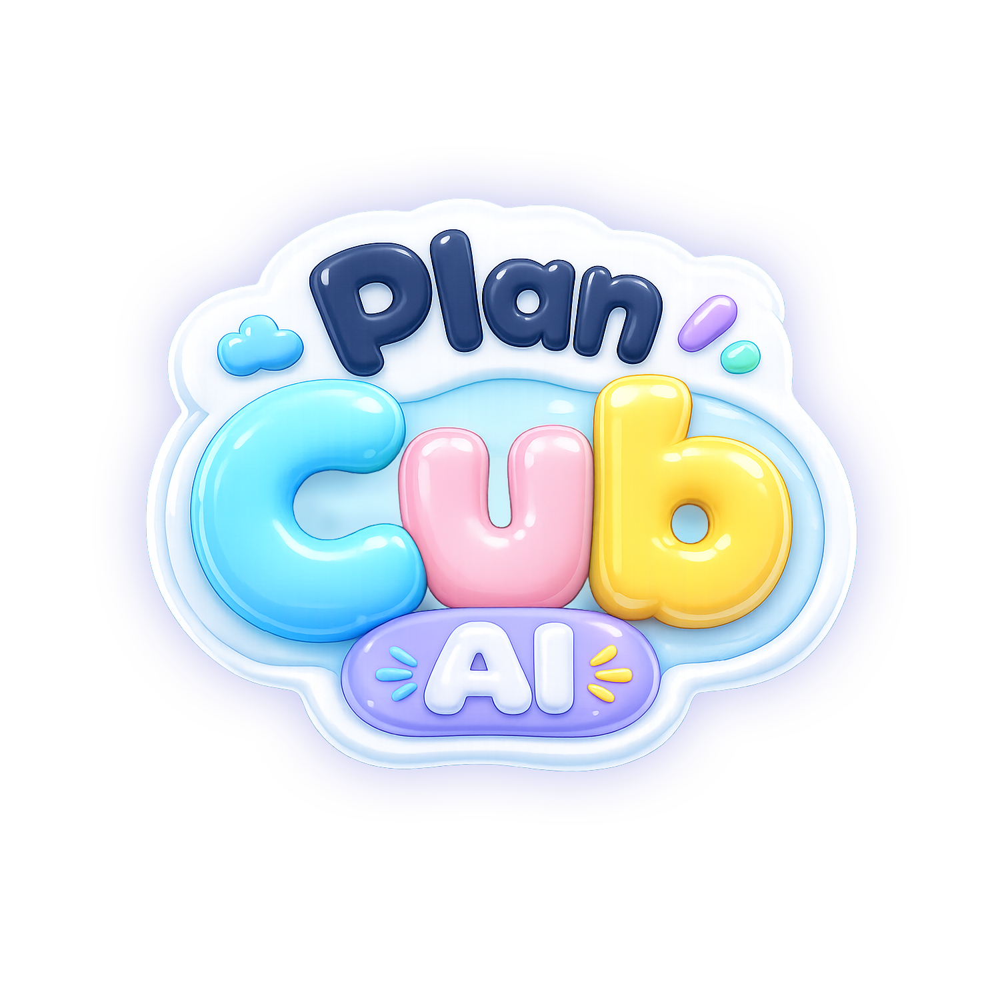

  

# Plan Cub AI — a 3x3 puzzle cube coach for Spectacles

An AR lens for [Snap Spectacles (2024)](https://www.spectacles.com/) where a
floating AI coach **teaches you how to THINK your way through a 3x3 puzzle
cube** — it never just solves it for you (unless you ask it to).

**Try it:** [published lens](https://www.spectacles.com/lens/c7993aeab3dd4856affd0acaca25df15?type=SNAPCODE&metadata=01)

## What it does

- **Full 3D cube** you turn with your bare hands: index-finger swipes turn
  layers, pinch + drag orbits the whole cube. Undo/redo, open palm = stop.
- **Learn mode**: a 5-stage lesson (white cross → corners → middle layer →
  yellow cross → last layer). The coach highlights the exact piece to work on,
  judges every move (green/yellow flash), explains *why*, and escalates help
  when you're stuck: words → arrows on the cube → the coach moves it for you.
- **Help-to-solve**: one tap completes the WHOLE current stage, move by move,
  narrating the reasoning — powered by an exact staged solver that mixes
  brute-force search with the classic beginner-method algorithms (Sune,
  Niklas, edge 3-cycles…), auto-translated to the cube's current orientation.
- **Mix & Play** free mode with time records, and a seeded **Daily Challenge**
  with streaks (same scramble for everyone, every day).
- **Trilingual**: English, Spanish, French — buttons, texts and voice
  (OpenAI TTS via Snap's Remote Service Gateway), switchable live by voice.
- A floating **character** that talks (mouth flaps with the audio) and reacts
  with expressions: happy, wrong, thinking, waiting, "aha!".

## Requirements

- **Lens Studio 5.15.x** (the Spectacles release line for 2024 hardware —
  this project is NOT compatible with 5.2x)
- Spectacles (2024) for hand tracking; the editor preview works for most of it
- Packages already included: Spectacles Interaction Kit, Remote Service Gateway

## Setup

1. Open `EXP1-SPECTACLES-NATIVO.esproj` in Lens Studio 5.15.
2. For the coach's voice: get a [Remote Service Gateway](https://developers.snap.com/spectacles/about-spectacles-features/apis/remote-service-gateway)
   token and paste it into the `RemoteServiceGatewayCredentials` component
   (tokens are intentionally blank in this repo — never commit yours).
3. Press play, pick a language, and follow the coach.

## Code tour (`Assets/Scripts/`)

| File | What it is |
|------|-----------|
| `CubeCoachPort.ts` | The cube: 27 cubies built at runtime, hand interaction, move engine, teaching aids (highlights, arrows, demos), and the exact staged solver (time-sliced IDDFS + classic algorithms as composite moves). |
| `CubeTutor.ts` | The coach: head-follow rig, lesson engine, speech queue (clips → OpenAI TTS → text), rich-text panel, buttons, daily challenge, character expressions. |
| `CoachStrings.ts` | The full trilingual script (EN/ES/FR), frozen so voice clips can be pre-recorded. |

Built with [Claude Code](https://claude.com/claude-code) as pair programmer, by
Flor Raffa. The teaching philosophy comes from solving the cube without ever
looking up a solution — the lens teaches you to see the cube, not to memorize it.
